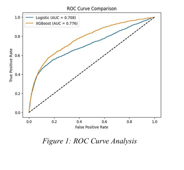
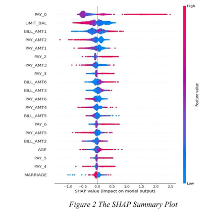

# Credit Card Default Prediction

## Overview

This project presents a comparative study of Logistic Regression and XGBoost for predicting credit card default using the UCI Credit Card Default Dataset.

The objective is to identify customers who are likely to default on their next credit card payment and compare the predictive performance of both machine learning models. Explainability techniques are also incorporated to improve transparency and interpretability of model predictions.

## Dataset

**Source:** UCI Machine Learning Repository

**Dataset:** Default of Credit Card Clients Dataset

### Dataset Information

* Total Records: 30,000
* Input Features: 23
* Target Variable: Default Payment Next Month
* Default Cases: 6,636
* Non-Default Cases: 23,364

### Features Included

* Credit Limit Amount (LIMIT_BAL)
* Age
* Gender
* Education
* Marital Status
* Repayment History (PAY_0 to PAY_6)
* Bill Statement Amounts (BILL_AMT1 to BILL_AMT6)
* Previous Payment Amounts (PAY_AMT1 to PAY_AMT6)

## Technologies Used

* Python
* Pandas
* NumPy
* Matplotlib
* Seaborn
* Scikit-Learn
* XGBoost
* SHAP
* LIME

## Methodology

1. Data Preprocessing
2. Exploratory Data Analysis
3. Feature Scaling
4. Train-Test Split (80:20)
5. Logistic Regression Model Training
6. XGBoost Model Training
7. Performance Evaluation
8. Explainability Analysis

## Models Implemented

### Logistic Regression

Used as a baseline model due to its simplicity and interpretability.

### XGBoost

Used to capture complex nonlinear relationships and improve predictive performance.

## Evaluation Metrics

* Accuracy
* Precision
* Recall
* F1-Score
* ROC-AUC Score

## Results

| Model               | Accuracy | Precision | Recall | F1-Score | ROC-AUC |
| ------------------- | -------- | --------- | ------ | -------- | ------- |
| Logistic Regression | 0.8077   | 0.6868    | 0.2396 | 0.3553   | 0.7076  |
| XGBoost             | 0.8155   | 0.6495    | 0.3602 | 0.4634   | 0.7760  |

## Visual Results

### ROC Curve Analysis



### SHAP Summary Plot



## Explainability

SHAP was primarily used to provide global and local explanations for model predictions, while LIME was explored for additional interpretability analysis.

The explainability framework helps identify the factors that contribute most significantly to credit default predictions.

## Key Findings

* XGBoost outperformed Logistic Regression across most evaluation metrics.
* Repayment history variables were the most influential predictors of credit default.
* SHAP explanations improved model transparency and interpretability.
* Explainable AI techniques help improve trust in financial decision-making systems.

## How to Run

1. Clone the repository

```bash
git clone <repository-url>
```

2. Install dependencies

```bash
pip install -r requirements.txt
```

3. Open and run the notebook

```bash
credit_card_default_prediction.ipynb
```

## Repository Structure

```text
Credit-Card-Default-Prediction/
│
├── credit_card_default_prediction.ipynb
├── UCI_Credit_Card.csv
├── requirements.txt
├── README.md
│
└── outputs/
    ├── roc_curve_analysis.png
    └── shap_summary_plot.png
```

## Authors

* Mandeep Kiran
* Kishan Sharma
* Sagar Raj
* Priyanka Behki

